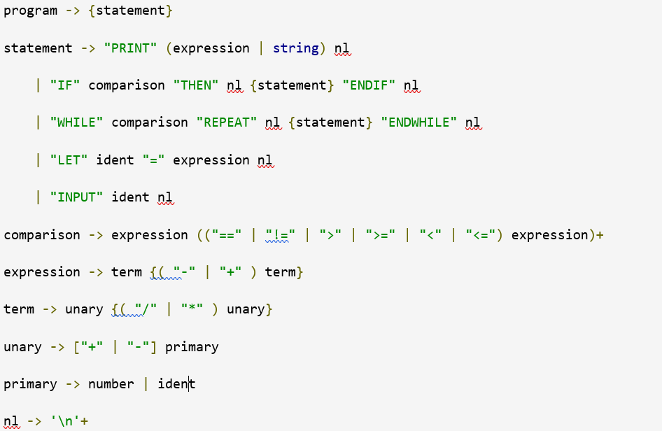

# AQU-Parser
The parser is the part of the compiler that ensures that the code follows the rules (syntax) of our language.
# Parser
<ul>
  <li>The parser is the component that will make sure the code follows the correct syntax. It does this by looking at the tokens, one at a time, and deciding if the ordering is legal as defined by our language.</li>
  <li>The input to the parser is the sequence of tokens and the output is the parse tree.</li>
  <li>A parse tree is a structured representation of the code.</li>
  <li>To create the parser, we first need to define the rules or grammar of the language.</li>
</ul>  

# Grammar
<ul>
 <li> statement ::= "PRINT" (expression | string) nl <ul>
     <li>There is a grammar rule named program that is made up of zero or more statement.</li>
     <li>Curly braces mean “zero or more” .</li> </ul>
  </li>
  
   <li> program -> {statement} <ul>
     <li>The statement rule here is defined as the PRINT keyword followed by either an expression or a string and then a newline.</li>
     <li>Expression and nl are other grammar rules. </li> </ul>
  </li>
  
  <li> | "IF" comparison "THEN" nl {statement} "ENDIF" nl <ul>
     <li>The statement rule here is defined as one of two options: either a PRINT statement or IF statements. </li>
     <li>This rule is is recursive. </li> </ul>
   
  </li>
    
   <li>Note: <ul>
      <li>Curly braces mean “zero or more”    </li>
   <li>Square brackets mean “zero or one” </li>
   <li> Plus operator means “one or more”  </li> 
  </li>
  
</ul>

  
 
 
#  Grammar Teeny Tiny programming language:

